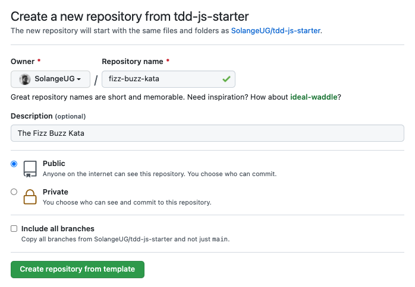

# JavaScript Starter

[][1]
[][2]
[][3]
[][4]

A kata starter project (skeleton) to practice test-driven development.

## Prerequisites

This starter project uses [JavaScript][1], [Node.js][2] and [yarn][4] as a package manager.

If you do not have Node.js and/or yarn installed locally, please follow these instructions:
- [Node.js installation][5]
- [yarn installation][6]


## Installation

To use this starter project:

- Click on the `Use this template` button
- Fill out the details of your new project
- Then click on `Create repository from template`




## Development

Once your new repository created, clone it locally, and install its dependencies:
- replace `${your-username}` with your GitHub username
- replace `${repository-name}` with the repository name you created above

```bash
git clone git@github.com:${your-username}/${repository-name}.git
cd ${repository-name}
yarn install
```

**For example, in my case the above commands would look like this:**

```bash
git clone git@github.com:SolangeUG/fizz-buzz-kata.git
cd fizz-buzz-kata
yarn install
```

### Next steps

Once the setup completed:
- update the description of your repository to match that of the kata
- execute the following command to run tests

```bash
yarn test
```

Enjoy working on your kata! :smile:


[1]: https://www.javascript.com/
[2]: https://nodejs.org/en/
[3]: https://jestjs.io/
[4]: https://classic.yarnpkg.com/en/
[5]: https://nodejs.org/en/download/
[6]: https://classic.yarnpkg.com/en/docs/install